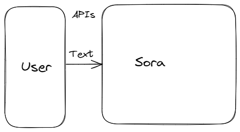
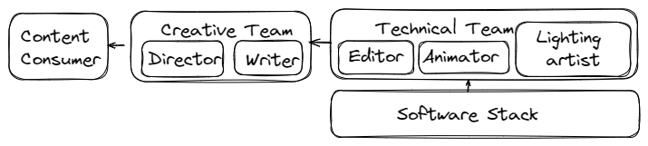
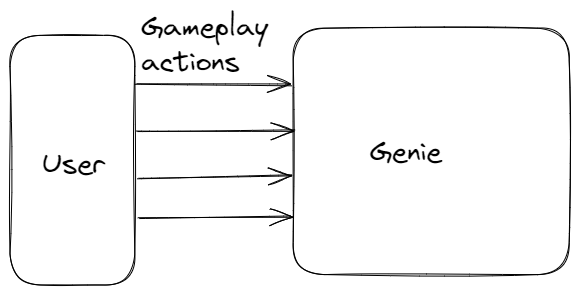

# Understanding the Promise of Google Genie: What it means for Businesses and Developers
Added: 2024-03-10  
Last updated: 2024-03-10

The field of artificial intelligence (AI) is rapidly evolving, and one particularly exciting development is the emergence of what are know in the artificial intelligence communities as "world models". These powerful AI systems are starting to transform the way we interact with computers and digital environments. Google's Genie and OpenAI Sora are two of the most popular examples of world models, poised to usher in a new wave of user experiences in content creation and gaming. With their unique interactive capabilities and end to end environment building capabilities, they are raising questions about what this means for businesses and professionals in the development stack.

### What are World Models?
World model is a term typically used to describe the internal representations a machine learning system forms during training to be able to serve the purpose it is trained for. A foundational models like large language models (LLMs) are thought to have a rich understanding of the world as learned from diverse datasets they are trained on doing justice to the term "world model". The more accurate technical use of the term is to describe the systems trained on multimodal datasets that use text, audio image as well as video data for their training and have the ability to simulate the natural world or an environment in some way and allows for ways to interact with it and use it as intended. 

Openai Sora and and Google Genie are two of the most popular and recent examples of these models that are bring attention to the area of research in AI. Openai Sora is a tool that uses text prompts to generate 1 minute long videos that are high quality and consistent with the real world. Google Genie is a foundational world model that allows for users to create video games from an image prompt that are playable. To be able to do this, it is asserted by their respective teams that the model learns the physical rules of the world or environment.

### OpenAI's Sora: Generating Videos from Text
OpenAI's [Sora](https://openai.com/sora) is a cutting-edge AI model capable of generating videos from simple text prompts. The remarkable quality of the videos generated by Sora demonstrates its understanding of the physical world and is [seen by openai](https://openai.com/research/video-generation-models-as-world-simulators) as a promising path towards general purpose world simulators.

*System diagram for Openai Sora*

While the videos generated by Sora seems impressive and realistic, it is still limited in how one can interact with it as it only allows for a text prompt as input. A game developer or a creator would desire more ways to interact with the system to be able to accomplish their goals. Popular softwares currently used for the purpose, including Blender or Unity allow for far more flexibility as evident from its [documentation](https://docs.unity3d.com/Manual/index.html). While it takes a lot of effort to create content with these softwares, since each of the building blocks is to be defined by the creators to some extent, the creators can utilize the flexibility that they get as a tradeoff. To allow for adoption in more real world applications, we can expect openai to be looking for ways to allow more interfaces for their model to meet these needs.

### Development Stacks and valuechains for content creators

*A typical content valuechain*

The above image describes a systems view of a simple content valuechain participants. While the above illustration describes a generalized and simplistic picture of content creation, the actual complexity can vary widely depending on the kind of content being created. Some youtube content creators take care of their content creation needs all on their on, some animation movie projects requires teams of hundreds of technical experts for various aspects of the project. 

*Content valuechain with Openai Sora*

While currently Sora only allows for creating videos and not making changes to an existing videos, for adoption in more real world applications, we can expect openai to be looking for ways to allow more interfaces for their model to meet these needs.

#### Training world models ###
Training models like Sora involves using large-scale datasets of images, videos, and text descriptions. To build these environments that offer more ways to interact with it, developers needs more sophisticated training data with text data associated with each API endpoint and mapped to a corresponding change in output. The models then learn the relationships between visual concepts and linguistic descriptions on its own. This learning process enables the model to translate text into visual representations, effectively generating videos.

While this accomplishes the goal for more flexible world models, the system has two critical issues that need to be addressed:
1. Data generation for changes in API as requirements change remains a challenge for developer teams.
2. The system is a black box and reliable change is not always possible.

### Google Genie: Interacting Without Action Labels
[Genie](https://sites.google.com/view/genie-2024/) is a foundational world model introduced by Google that goes a step beyond Sora, and allows users to generate a variety of playable worlds from images. This can be seen as a simulation being created from a set of images similar to Sora, but with an additional feature of taking input from a user playing the game. It solves the above mentioned challenges by training the model without the need for pre-defined "action labels." As earlier discussed, these labels are required to train AI models to perform specific tasks. Genie's ability to bypass this requirement is a significant breakthrough. It demonstrates AI's increasing adaptability to natural patterns of interaction.

*System diagram for google genie*

### Conclusion
Google Genie hints at a future where we can interact with generative worlds without the need to explicitly train them on specific actions. This new generation of world models allows us to develop foundational world models that allow for more ways to interact with it. The applications for such models are vast – revolutionizing industries from entertainment and education to scientific research and software development.

Let me know if you'd like me to add more detail to any particular section or if you wish to focus on a specific application area of Google Genie!