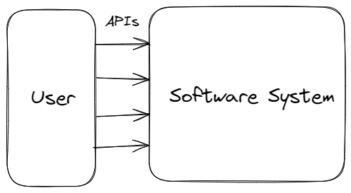

# Understanding the Promise of Google Genie: A New Era of Interactive World Models
Added: 2024-03-10  
Last updated: 2024-03-10

The field of artificial intelligence (AI) is rapidly evolving, and one particularly exciting development is the emergence of world models. These powerful AI systems are starting to transform the way we interact with computers and digital environments. Google's Genie is one such model, poised to usher in a new wave of user experiences with its interactive capabilities and potential use within a "foundational interactive environment."

### What are World Models?
World model is a term typically used to describe the internal representations a machine learning system forms during training to be able to serve the purpose it is trained for. A foundational models like large language models (LLMs) are thought to have a rich understanding of the world as learned from diverse datasets they are trained on doing justice to the term "world model".

The term is now more popularly being used to describe machine learning systems that simulate the natural world in some way and allows for ways to interact with it and use it in a specific way. Openai's Sora, for example, allows for users to generate videos from text prompts. Google's genie and Nvidia Omniverse are other popular example systems that are often called "world models"

### Interfaces and abstractions for world models
A typical software system can be represented simply with the below diagram where a user interacts with a software by making requests to it APIs.

*A typical interaction between a user and a software system*

A machine learning system is similar in that, it allows for user to make a request to it via APIs and get a response. 

### OpenAI's Sora: Generating Videos from Text
OpenAI's Sora is a cutting-edge world model capable of generating videos from simple text prompts. This astounding power underscores the potential of world models to transform content creation. Imagine a world where you can type a description, and a fully rendered video comes to life. 

*System diagram for Openai Sora*

While the video generated seems impressive and realistic, it is still limited in how one can interact with the world model as it only allows for a text prompt as input. A game developer or a creator would desire more ways to interact with the system to be able to accomplish their goals. Popular softwares currently used for the purpose, including Blender or Unity allow for far more flexibility as evident from their [API documentation](https://docs.unity3d.com/Manual/index.html). To allow for adoption in more real world applications, we can expect openai to be looking for ways to allow more interfaces for their model to meet these needs.

**Training world models**
The training of world models like Sora involves large-scale datasets of images, videos, and text descriptions. input. Building world models that allows for more ways to interact with it, needs more sophisticated training data in form of text data associated with each API endpoint mapped to a corresponding change in output. The models then learn the relationships between visual concepts and linguistic descriptions. This learning process empowers the model to translate text into visual representations, effectively generating videos.

*A generalised system diagram of user interacting with a world model*

While this accomplishes allows for more flexible world models, the system has two critical issues that need to be addressed:
1. Data generation for changes in API as requirements change remains a challenge for developer teams.
2. The system is a black box and reliable change is not always possible.

### Google Genie: Interacting Without Action Labels
Genie is a world model introduced by Google that goes a step beyond Sora, and allows users to interact with the model and influence its output. It alse solves the above mentioned challenges by training the model without the need for pre-defined "action labels." As earlier discussed, these labels are required to train AI models to perform specific tasks. Genie's ability to bypass this requirement is a significant breakthrough. It demonstrates AI's increasing adaptability to natural patterns of interaction.

*System diagram for google genie*

Having such capabilities for creating simulation environments, would allow for creation of models on greater scale and much diverse use cases such as,
1. Environments for video game creators
2. Simulations for scientific research
3. Content creation

### Conclusion
Google Genie hints at a future where we can interact with generative worlds without explicitly having to train them on specific actions. This new generation of world models allows us to develop foundational world models that allow for more ways to interact with it. The applications for such models are vast – revolutionizing industries from entertainment and education to scientific research and software development.

Let me know if you'd like me to add more detail to any particular section or if you wish to focus on a specific application area of Google Genie!